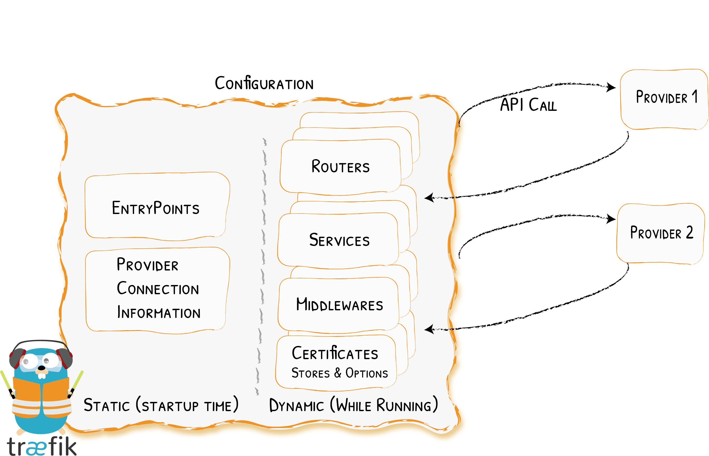
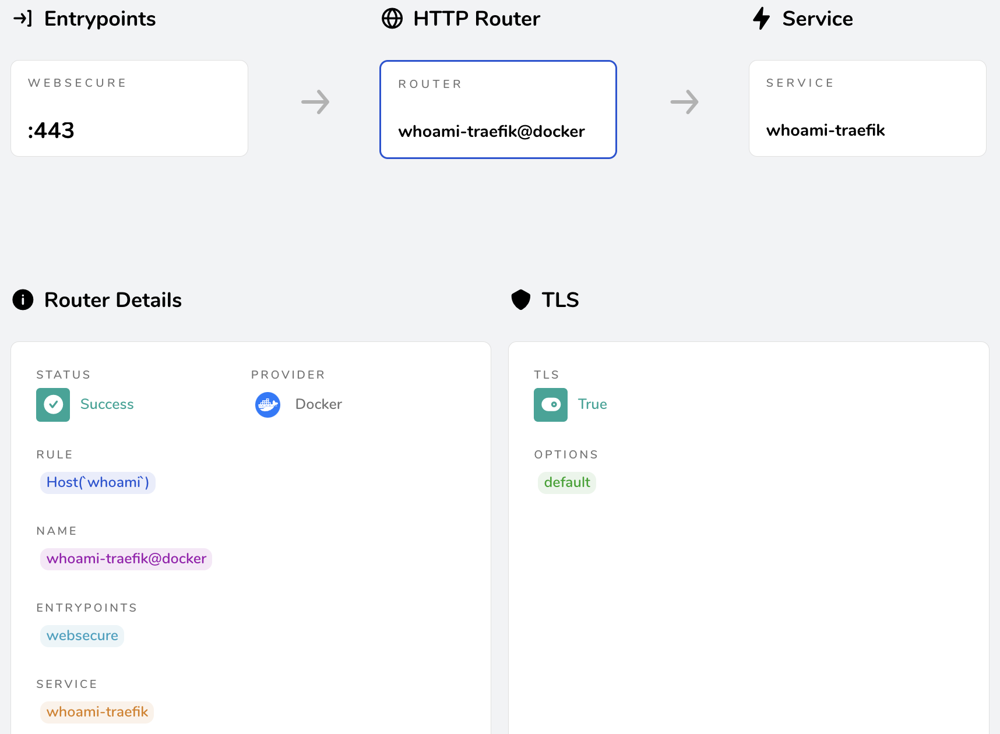
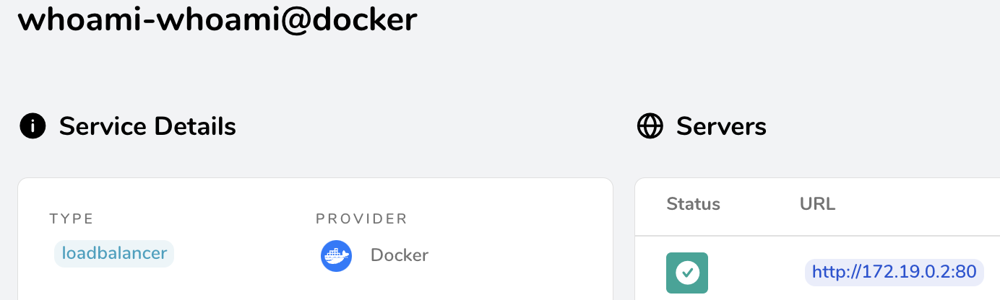

# Traefik 101

Many of us are running traefik. If you're like me, you copy/pasted some `docker-compose.yaml` from a webpage, added some `labels` to your other `docker-compose.yaml` files, and things went up and running. Sooner or later you want to have something more fancy, and you need to understand what you actually did. RTFM and all that, you look at https://doc.traefik.io, and ... it's a mess. Honestly, I'm lost in this documentation.

It talks about static and dynamic configuration, without really explaining which options are part of which. Where does `http` come from, and what are the options? Some parts like `providers` are explained twice, and you'll have to figure out which one you need. Other things like the automagic traefik is doing with docker is not really explained. In the end I started with a `docker-compose.yaml` on my laptop, added some `traefik.yaml` and `dynamic.yaml`, and copy/pasted things around until it made sense.

This post is the result of my experiments with traefik, which I applied now to my server, where they run happily ever after. Or so I hope :)

## Setup

My server setup is the following:
* `docker-compose.yaml` files in home-directories, with one user per service
* one or more domains with potential subdomains for each service
* using letsencrypt for getting certificates

I'll use `SERVER_IP` in the rest of this post to represent the public IP address of the server.

Also, this post supposes you're running traefik v3 - at least one option used here is not available for traefik v2: `entrypoints.websecure.asDefault`.

### Testing Setup Locally

You can test all of this locally on your computer, be it Windows, Mac, or Linux, as long as docker runs. Create a temporary directory representing the `/home` directory of the real server, e.g., `~/tmp/traefik101`. Then, instead of using `/home/traefik`, you'll use `~/tmp/traefik101/treafik`.

Whenever you see `SERVER_IP`, you'll have to replace it with `127.0.0.1`. 
You can use local domains if you add them to `/etc/hosts`. For example, to add `whoami` to `/etc/hosts`, the following command will do so:
```bash
echo "127.0.0.1   whoami" | sudo tee -a /etc/hosts
```
Of course a `sudo vi /etc/hosts` or whatever editor you prefer also works. On Windows, the file seems to be `C:\Windows\System32\drivers\etc\hosts`, but I didn't try this one out.

## Glossary of Traefik Terms

This is a list of all traefik terms used in this post. They are linked to the documentation of traefik, to allow you to dive deeper into each definition.

As an overview, the following image shows the different components described in this blog post:

Fig: from the [Traefik configuration overview](https://doc.traefik.io/traefik/v3.2/getting-started/configuration-overview/)
 
* [Static configuration](https://doc.traefik.io/traefik/v3.2/getting-started/configuration-overview/#the-static-configuration) - only loaded when traefik starts
	* [entryPoints](https://doc.traefik.io/traefik/v3.2/routing/entrypoints/) - which ports traefik will open and listen on
	* [providers](https://doc.traefik.io/traefik/v3.2/providers/overview/#supported-providers) - sources for dynamic configurations, for this post only [docker](https://doc.traefik.io/traefik/v3.2/providers/docker//) and [file](https://doc.traefik.io/traefik/v3.2/providers/file/) providers are used
	* [certificatesResolvers](https://doc.traefik.io/traefik/v3.2/https/acme/) - allow creating TLS certificates. We'll use LetsEncrypt in this post
	* [log](https://doc.traefik.io/traefik/v3.2/observability/logs/), [accesslog](https://doc.traefik.io/traefik/v3.2/observability/access-logs/), [api](https://doc.traefik.io/traefik/v3.2/operations/api/) - for debugging. Once everything works, these should be commented out
* [Dynamic configuration](https://doc.traefik.io/traefik/v3.2/getting-started/configuration-overview/#the-static-configuration) - can be modified without having to restart traefik
	* [http](https://doc.traefik.io/traefik/v3.2/routing/overview/) for everything related to http traffic. In this post we'll cover
		* [services](https://doc.traefik.io/traefik/v3.2/routing/services/) which are endpoints for the traffic
		* [middlewares](https://doc.traefik.io/traefik/v3.2/middlewares/overview/) to modify the traffic between the `entryPoints` and the `services`
		* [routers](https://doc.traefik.io/traefik/v3.2/routing/routers/) use rules to pass traffic between an `entryPoint` and a `service`
	* [tls](https://doc.traefik.io/traefik/v3.2/https/acme/) to define which TLS protocols we want traefik to accept and process
	* [tcp](https://doc.traefik.io/traefik/v3.2/routing/routers/#configuring-tcp-routers), [udp](https://doc.traefik.io/traefik/v3.2/routing/routers/#configuring-udp-routers), which are not covered in this post, but also allow the definition of `services`, `middlewares`, and `routers`

Furthermore, I'm using `docker container` and `docker compose service` interchangeable in this document.

# Configuring Traefik

The following is my current setup on my server, which you can use as the base for your own configuration. You can use it to start your own experiments - either by starting locally, or by being very brave (stupid?) and use it directly on your server. All the files can also be found in the following github repo:

https://github.com/ineiti/treafik-101 

## docker-compose.yaml

The following `docker-compose.yaml` file doesn't include any of the `labels` you might have seen in other tutorials. In this post, all configuration is stored in files. This makes it easier to understand the configuration and change some settings for debugging.

On my server, I created a `traefik` user, and put this file in `/home/traefik/docker-compose.yaml`:

[docker-compose.yaml](./docker-compose.yaml)

### Static Configuration - config/traefik.yaml

This is the main configuration file. Together with the dynamic configuration file, it is in `/home/traefik/config`, and should belong to the `traefik` user.

In the traefik documentation, this is called the **static configuration**, because it is supposed
to not change a lot. All http/tcp/udp/tls specific configuration will go into the **dynamic configuration**. The following is mostly trial and error: besides mentioning static and dynamic configuration, I couldn't find descriptions in the traefik documentation which configuration options belong to which part.

This configuration sets up:
* two entrypoints, one for http and one for https
* a docker provider to automagically set up routes and services for docker containers
* a file provider for additional dynamic configuration
* certificate resolver to use letsencrypt for setting up TLS certificates
* debugging using logging and dashboard


[config/traefik.yaml](./config/traefik.yaml)

### Dynamic Configuration - config/dynamic.yaml

The traefik documentation calls this the **dynamic configuration**, because it changes more often than the static one. YMMV, I'm changing the logging levels more often than TLS options, but who am I to judge?

This file configures two things:
* redirect all requests for http://mydomain.com to https://mydomain.com
* only allow TLS >= 1.2, and for TLS=1.2, only allow secure protocols

[config/dynamic.yaml](./config/dynamic.yaml)

## Starting up Traefik

With the above configuration files, you should have a directory-tree which looks like this:

```
.
├── docker-compose.yaml
├── config
│   ├── dynamic.yaml
│   └── traefik.yaml
```

If you have docker installed, and the traefik user has the right to use docker, you should be able to start traefik with the following command:

```bash
docker compose up
```

During setup I don't add the `--detach` argument so I can see any errors or warnings directly. If you have the `api:insecure` enabled, you should be able to connect to the dashboard using a browser pointing to http://SERVER_IP:8080. If you can't reach the dashboard, look through the logs to see what went wrong.

# Adding Services

Now you can add services which will be more or less automatically added to traefik.

## Simplest Example With one Hostname


Fig: the simplest configuration of traefik with a direct route from the entrypoint to the service.

Let's create a simple example with a hostname. If you run this locally on your computer, you can choose any hostname, and add it to `/etc/hosts`. If you bought a domain name and configured it to point to your SERVER_IP, you can also use directly this domain name, or any subdomains. Traefik is very fond of the `whoami` service which returns the IP of the client. Let's use it by creating a new `docker-compose.yaml` file. On a dedicated server, create a `whoami` user, give it the rights to use `docker`, and then create the file `/home/whoami/docker-compose.yaml` with the following content:


[docker-compose.simple.yaml](./services/docker-compose.simple.yaml)
```yaml
services:  
  whoami:
    image: traefik/whoami
    networks:
      # The docker container needs to connect to the traefik network.
      - traefik
    labels:
      # Enable traefik to do its magic router and service setup.
      - "traefik.enable=true"
      # Give the domain name for the Host(`fqdn`) rule.
      - "fqdn=whoami"

networks:
  traefik:
    external:
      # This is because docker compose renamed the `traefik` network by
      # prepending the directory name.
      name: traefik_traefik
```

If you're running this locally on your computer, be sure to add `whoami` as a reference to localhost in your `/etc/hosts`. Start the new service with `docker compose up`. The traefik log output should now reflect that it detected a new service and set it up. Looking at http://SERVER_IP:8080/dashboard/#/http/routers, you should see that traefik created a `HTTP Router` for the whoami docker container.

## Defining the Port


Fig: traefik will connect the router automatically to the service in the `docker-compose.yaml` 

Using traefik, you don't need to expose the port in the docker-compose.yaml file with the `ports:` directive. It is enough if the `Dockerfile` has an `EXPOSE` directive. You can check that this is the case for `traefik/whoami` with `docker inspect traefik/whoami` and search for `ExposedPorts`. If you have a docker-image with a missing `EXPOSE` directive, you can create a traefik service with the internal port. Of course, your docker image must listen on this port not only on `127.0.0.1`, but on the global `0.0.0.0` address.

Traefik will then pick up this service and connect the newly created router to. If you define more than one service for your docker container, traefik will complain with an error and not create a router for this docker container!

[docker-compose.port.yaml](./services/docker-compose.port.yaml)
```yaml
services:  
  whoami:
    image: traefik/whoami
    networks:
      - traefik
    labels:
      - "traefik.enable=true"
      - "fqdn=whoami"
      # Defining the service with the port is enough - traefik will pick
      # it up and connect it with the appropriate router.
      - "traefik.http.services.whoami-whoami.loadbalancer.server.port=80"

networks:
  traefik:
    external:
      name: traefik_traefik
```

## Multiple Domains for One Service


Fig: the router created by traefik with a rule to accept two hostnames

If you want to route multiple domains to a single docker container, you can add a label to inform traefik your rule should allow a list of hosts. While using `HostRegexp` is also a possibility, traefik will complain that it cannot extract the domain names to pass them to the `certificatesResolvers`. But using a list of `or`ed `Host`s allows traefik to extract the domain names and create certificates for each one of them.

Again, traefik is smart enough to pick up any router name you choose, and will create a service for you and connect the router to the service and the `websecure` endpoint. Of course you can combine this with the previous example if the docker image doesn't expose a port.

[docker-compose.multidomain.yaml](./services/docker-compose.multidomain.yaml)
```yaml
services:  
  whoami:
    image: traefik/whoami
    networks:
      - traefik
    labels:
      - "traefik.enable=true"
      # Define all needed hosts with an 'or'. No need to add the `fqdn` label.
      - "traefik.http.routers.whoami-traefik.rule=(Host(`whoami1`) || Host(`whoami2`))"

networks:
  traefik:
    external:
      name: traefik_traefik
```

## Pass-Through http as well as https

As a final example I add what brought me to this journey: I wanted to add the possibility for a project to have a direct http connection, in parallel to the https connection. This was needed in my case because the ESP32 library had trouble using Server Side Events with https.

To spice it up, the rules are:
* If the request goes to http://whoami/api, let it pass
* Route all requests to https://whoami to the traefik service of the docker container
* All other requests to http://whoami should be redirected to https://whoami

[More advanced pass-through and redirection](./traefik-pass-through.png)
Fig: the three rules from above, and the default rule with the lowest priority of 1

[docker-compose.pass-through.yaml](./services/docker-compose.pass-through.yaml)
```yaml
services:  
  whoami:
    image: traefik/whoami
    networks:
      - traefik
    labels:
      - "traefik.enable=true"
      - "fqdn=whoami"
      - "traefik.http.routers.web-whoami-traefik.entrypoints=web"      
      # Only route the `/api` path directly using http.
      - "traefik.http.routers.web-whoami-traefik.rule=(Host(`whoami`) && Path(`/api`))"
      # For all other requests to this domain, create a redirect to https
      - "traefik.http.routers.webredirect-whoami-traefik.entrypoints=web"
      - "traefik.http.routers.webredirect-whoami-traefik.middlewares=http-redirect@file"
      # Finally add the websecure router - as at least one router is defined
      # manually, traefik will not add the websecure router on its own.
      - "traefik.http.routers.websecure-whoami-traefik.entrypoints=websecure"

networks:
  traefik:
    external:
      name: traefik_traefik
```

# How Traefik Uses the Docker Provider

One thing I missed in the traefik documentation is what magic traefik does to create the routers and the services. To create a mental model for this I ran different `docker-compose.yaml` files with different static and dynamic configurations to figure out what traefik will do. This is what I came up with:

* if `traefik.enable=true` is missing, traefik doesn't do anything with this docker container
* traefik reads the `traefik.http.(routers|services)` labels and sets up the corresponding `routers` and `services`
	* the other entires like `middlewares` are also interpreted, but are not automatically included
* if no `services` are defined, it sets up a new traefik service with the name of the docker container (docker compose service):
	* if a port is exposed (either in the Dockerfile or the docker-compose.yaml), it ties to this port
	* if multiple ports are exposed, it ties to the lowest port
	* if no ports are exposed, traefik will report an error and not create any service for this docker container
* if no `routers` are defined, it sets up a router with the name of the docker container and the following configuration:
	* using the `websecure` entrypoint, as this one was defined `asDefault` in `config/traefik.yaml`
		* without the `asDefault` option, traefik would set up a `router` for both the `web` and the `websecure` entrypoints
	* adding `tls: {}` to the router
	* using the rule `Host('fqdn')` , as defined in `providers:docker:defaultRule` in `config/traefik.yaml`
		* here the `fqdn` is replaced with the value of the label `fqdn` of the docker container
	* pointing to the `service` defined by this docker container. If multiple or no services are defined in this docker container, traefik reports an error
* if one or more `router`s are defined by the docker container's labels, regardless of the name given, it will complete the `router`s:
	* add  `tls: {}` if the router's `entrypoint` is `websecure`
	* add any of the missing `service`, `rule`, `entrypoint`, as with a new router

# Comments

You can leave a comment or a suggestion in the issues here.